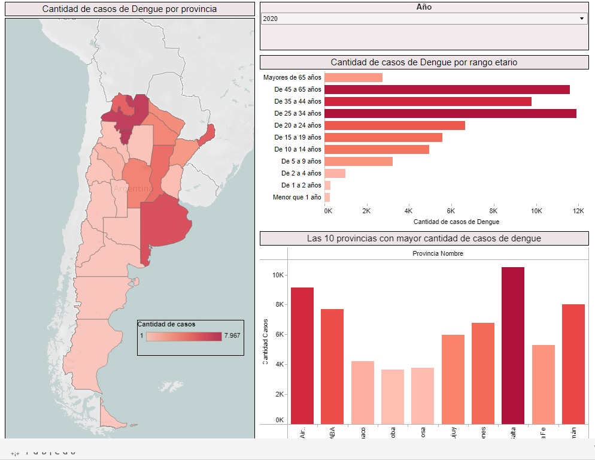

# Tableau_Dengue_Argentina

# Dashboard con informacion de los casos de dengue en argentina desde el año 2018-2021

Este dashboard fue hecho con el fin de aprender a utilizar la herramienta de visualizacion de datos Tableau.

Para este dashboard se utilizaron datasets disponibles publicamente en la pagina [https://www.datos.gob.ar/](https://www.datos.gob.ar/https:/)

* Se realizo una limpieza de los 4 datasets y se guardaron en un solo archivo combinando los datos de los años 2018 a 2021.
* El archivo dengue_final que se encuentra en la carpeta ETL se cargo a tableau.
* En el Dashboard se puede ver:
  * Un mapa de calor basado en las provincias argentina y la cantidad de casos de Dengue.
  * Una lista de desplegable que permite filtrar toda la informacion del dashboard por año.
  * Un grafico de barras que muestra la cantidad de casos de dengue por rango etario. Al hacer click en una provincia del mapa se puede obtener informacion del rango etario de los casos de esa provincia.
  * Un grafico de barras que muestra las 10 provincias con mayor cantidad de casos de dengue.

La calidad y cantidad de los datos no es optima para realizar un buen analisis. El año 2020 es el que tiene una mayor cantidad de datos que los otros años. No se encontraron datasets de años anteriores o posteriores a los usados.
